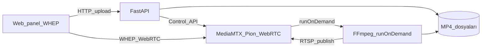

# MediaMTX Video Panel

**Sürüm 1.0.0** — Web panelinden video yükleyin; tarayıcıda **HLS**, VLC’de **RTSP** ile izleyin.

Arka planda [MediaMTX](https://github.com/bluenviron/mediamtx) kullanılır. WebRTC (Pion) deneysel olarak sunulur; tarayıcı için önerilen yol **HLS**’tir.

## Gereksinimler

- Docker ve Docker Compose
- `.env` içinde doğru `MTX_PUBLIC_HOST` (LAN IP)

## Hızlı başlangıç

```bash
cd ~/Projects/mediamtx-web
cp .env.example .env
# MTX_PUBLIC_HOST=192.168.x.x  (bu makinenin LAN IP'si)
docker compose up --build -d
```

- **Panel:** http://localhost:3000
- **HLS (tarayıcı):** http://\<MTX_PUBLIC_HOST\>:8888/\<video-id\>/index.m3u8
- **RTSP (VLC):** rtsp://\<MTX_PUBLIC_HOST\>:8554/\<video-id\>
- **WebRTC (deneysel):** http://\<MTX_PUBLIC_HOST\>:8889/\<video-id\>

## Nasıl çalışır



1. Video HTTP ile yüklenir (`data/videos/`).
2. MediaMTX path oluşturulur (`runOnDemand` + FFmpeg).
3. İzleyici bağlanınca FFmpeg dosyayı RTSP ile publish eder; MediaMTX **WebRTC** olarak sunar.
4. Panel **WHEP** ile tarayıcıda oynatır.

## İzleme

| Yöntem | URL |
|--------|-----|
| Panel | **Tarayıcıda izle** (HLS, port 8888) |
| MediaMTX sayfası | `http://<host>:8889/<video-id>` |
| WHEP (GStreamer, vb.) | `http://<host>:8889/<video-id>/whep` |

**Beklemede** = henüz izleyici yok (normal). İlk WebRTC bağlantısında FFmpeg 5–30+ sn sürebilir.

## Portlar (mediamtx `network_mode: host`)

MediaMTX doğrudan sunucu ağında dinler:

| Port | Açıklama |
|------|----------|
| 3000 | Web panel |
| 8080 | API |
| 8888 | HLS (tarayıcı — önerilen) |
| 8889 | WebRTC HTTP / yerleşik oynatıcı |
| 8189/udp, 8190/tcp | WebRTC medya (ICE) |
| 8554 | RTSP (yalnızca FFmpeg publish) |
| 9997 | Control API |

Docker bridge üzerinde WebRTC UDP genelde çalışmaz; bu yüzden **host ağı** kullanılıyor.

## Ortam değişkenleri

```bash
MTX_PUBLIC_HOST=192.168.1.100   # WebRTC ICE / URL'ler için zorunlu
MAX_UPLOAD_BYTES=53687091200    # ~50 GB, 0 = sınırsız
```

## Sorun giderme

```bash
docker compose ps
docker compose logs mediamtx --tail 40
docker compose logs api --tail 40
curl -s http://localhost:8080/api/health
```

| Sorun | Çözüm |
|-------|--------|
| Web arayüzde görüntü yok | **Tarayıcıda izle** (HLS 8888). `docker compose up --build -d` + sync zorunlu |
| WebRTC “peer connection closed” | Yerelde STUN kapalı; HLS kullanın veya `webrtcAdditionalHosts` + UDP 8189 |
| WebRTC bağlanmıyor | `MTX_PUBLIC_HOST` gerçek LAN IP; UDP **8189** / TCP **8190** açık |
| Beklemede / siyah ekran | MediaMTX restart sonrası path silinir — API otomatik senkron eder; sayfayı yenileyin |
| Eski videolar | `curl -X POST http://localhost:8080/api/videos/sync` veya API restart |
| Beklemede kalıyor | **WebRTC izle** tıklayın; büyük dosyada 1–2 dk bekleyin |
| Upload 413 | `.env` → `MAX_UPLOAD_BYTES` |
| 401 API | `docker compose up --build -d` (auth yapılandırması) |

## Yerel geliştirme

```bash
# Sadece MediaMTX
docker compose up --build mediamtx -d

# API
cd backend && pip install -r requirements.txt
export MTX_API_URL=http://127.0.0.1:9997 MTX_RTSP_URL=rtsp://127.0.0.1:8554 PUBLIC_HOST=localhost
uvicorn app.main:app --reload --port 8080

# Frontend
cd frontend && npm install && npm run dev
```

## Notlar

- **VLC / RTSP** bu sürümde panelden kaldırıldı; odak WebRTC.
- İnternet üzerinden izleme için TURN sunucusu (`webrtcICEServers2`) eklenebilir.
- Codec: FFmpeg çıkışı H.264 baseline (WebRTC uyumlu, B-frame yok).
